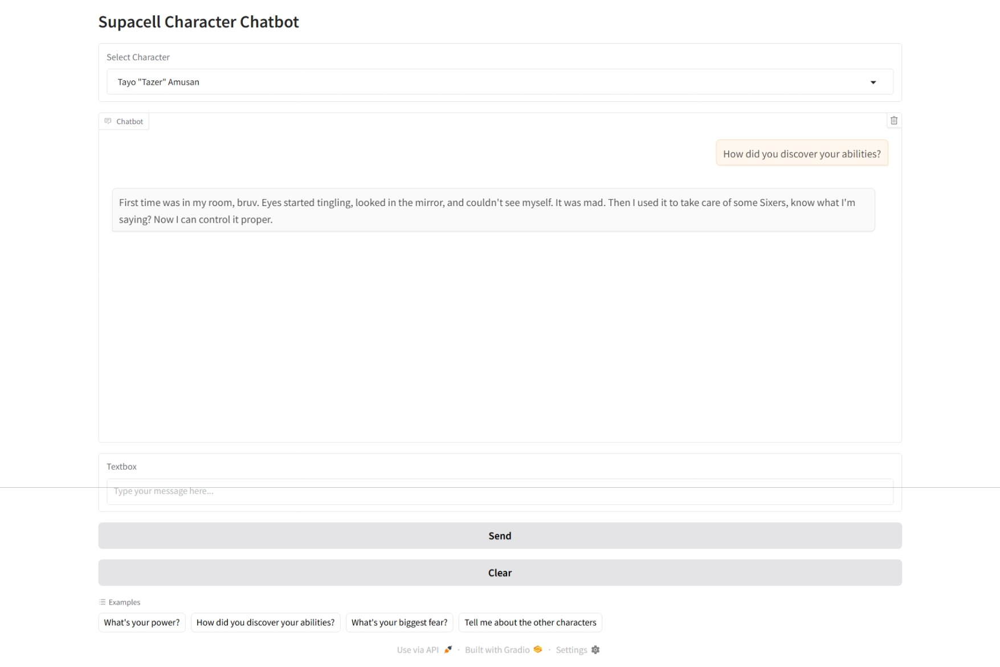

# Supacell Character Chatbot

## Overview

This project is an interactive chatbot that lets users talk to the 5 main characters from the Netflix series [Supacell](https://en.wikipedia.org/wiki/Supacell).

## Features
- **Curated Q&A:** The chatbot uses a set of pre-written questions and answers to ensure responses are accurate and true to each character.
- **Character Authenticity:** Each character's responses reflect their personality, speech patterns, and relationships from the show.
- **Prompt Engineering:** The system combines pre-written answers with AI-generated text.

## Technologies that were used for this project

- Python 3.11
- Hugging Face Transformers (for optional generative responses)
- Google Flan-T5-small (77M parameters)
- Gradio (for the web interface)
- NLTK (for text processing)

## How the chatbot works

1. Loads detailed character profiles and Q&A from `character_profiles.txt`.
2. Matches user questions to prewritten answers for reliability.
3. Applies character-specific speech patterns for realism.
4. Falls back to a small language model (Flan-T5 Small) for open-ended questions.
5. Loads character dialogue samples from individual text files.

## Example Conversation
>**User:** How did you discover your ability?

>**Sabrina:** I discovered it in the worst possible way. I found out Kevin was cheating on me. I was so angry, and suddenly he was thrown against the door without me touching him.

## Limitations
- Open-ended messages may produce inconsistent results due to model size constraints.
- Best results come from questions covered by pre-written templates.
- Model runs on CPU by default (slower than GPU inference).

## Screenshots

